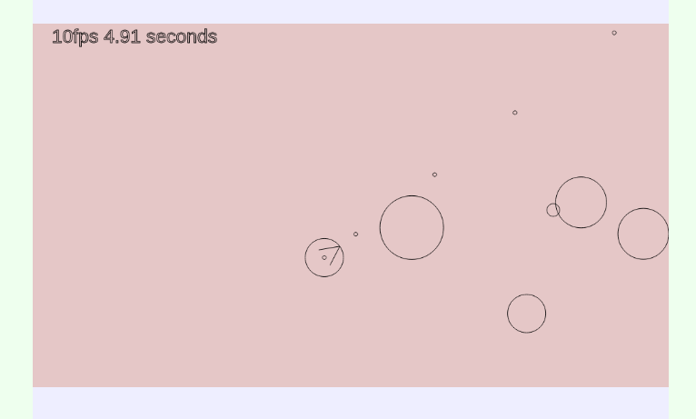
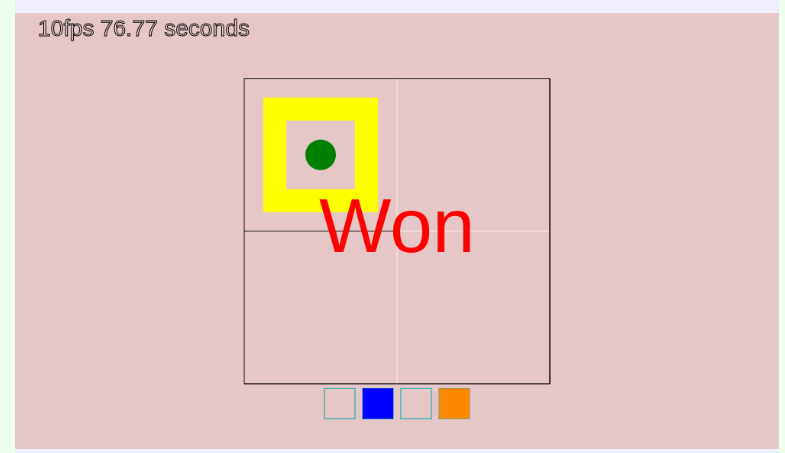
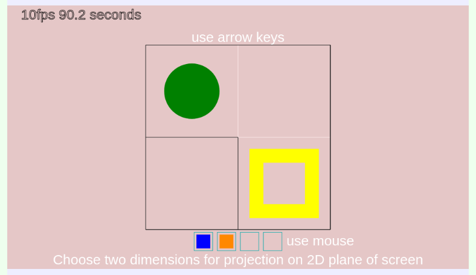

# Canvas Asteroids Game



# N-dimensional maze game





You could change dimension on following string in code by modifying constants and by changing their amount

```
this.narr = [maze_rows, maze_cols, maze_depth, maze_4dim];
```
